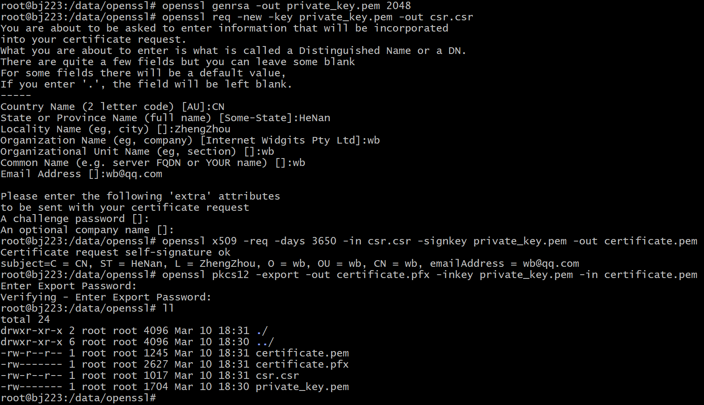

# 一、快速开始
```shell
go get -u github.com/go-openssl/openssl
```
# 二、示例
#### 1、根据```PHP```实现```sign```
```php
openssl_sign($data, $sign, $privateKey, OPENSSL_ALGO_SHA256)
```
```go
package main

import (
    "crypto"
    "fmt"
    
    "github.com/go-openssl/openssl"
)

func main() {
    openSSL, err := openssl.New(
        openssl.WithHash(crypto.SHA256),
        openssl.WithPrivateKeyText([]byte("private-key-text")),
    )
    if err != nil {
        panic(err)
    }
	
    sign, err := openSSL.Sign("hello world")
    if err != nil {
        panic(err)
    }
	
    fmt.Println(sign)
}

```
#### 2、根据```PHP```实现```verify```
```php
openssl_verify($data, base64_decode($sign), $publicKey, OPENSSL_ALGO_SHA1)
```
```go
package main

import (
    "crypto"
    "fmt"
    
    "github.com/go-openssl/openssl"
)

func main() {
    openSSL, err := openssl.New(
        openssl.WithHash(crypto.SHA1),
        openssl.WithPublicKeyText([]byte("public-key-text")),
    )
    if err != nil {
        panic(err)
    }

    var sign string

    ok, err := openSSL.Verify("hello world", sign)
    if err != nil {
        panic(err)
    }

    fmt.Println(ok)
}
```
# 三、生成```.cer```和```.pfx```证书
#### 1、生成采用```des3```算法保护的私钥
```shell
openssl genrsa -des3 -out private-rsa.key 1024
```
#### 2、生成公钥证书
```shell
openssl req -new -x509 -key private-rsa.key -days 3650 -out public-rsa.cer
```
#### 3、生成```PKCS12```格式```Keystore```
```shell
openssl pkcs12 -export -name test-alias -in public-rsa.cer -inkey private-rsa.key -out user-rsa.pfx
```

